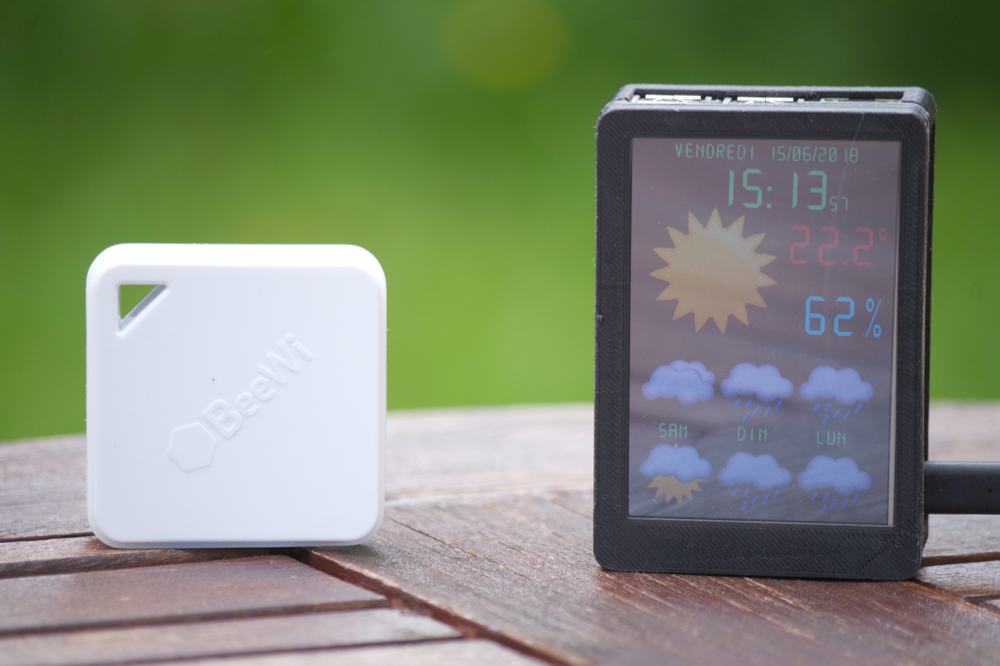
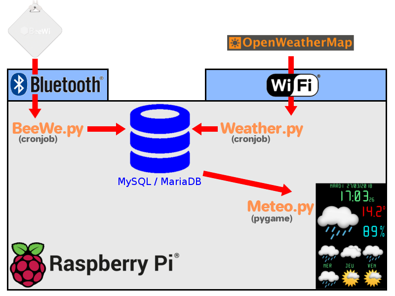
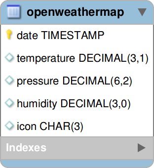
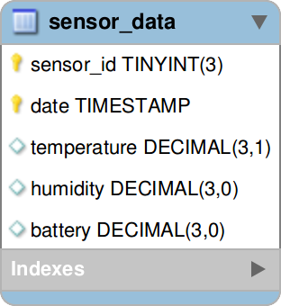
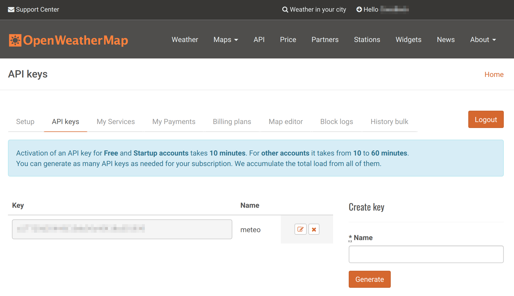
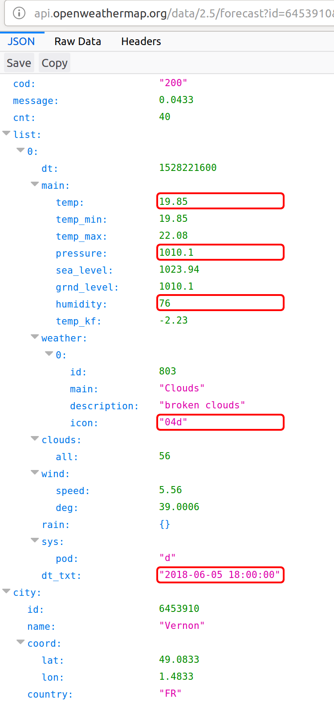
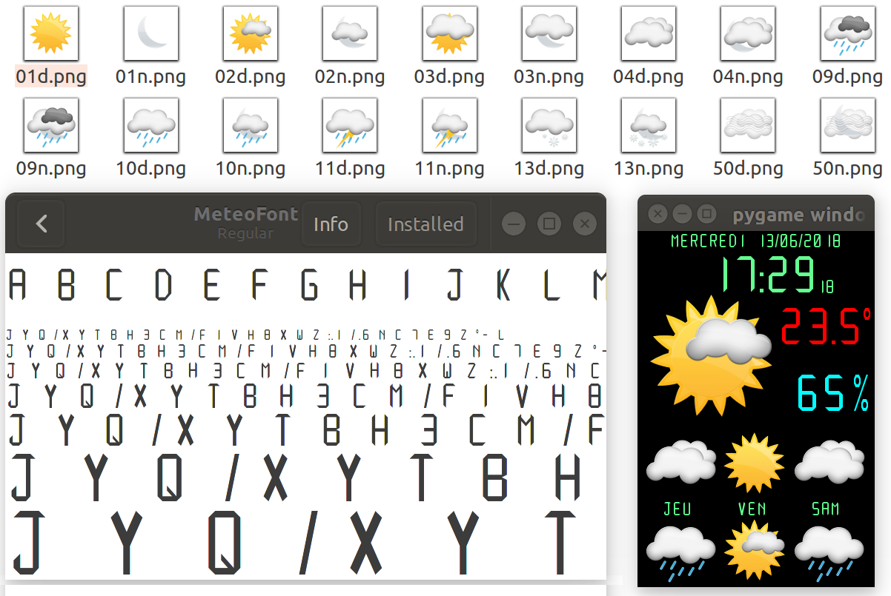

# Créer sa station météo à l’aide du Raspberry Pi et de son écran 3.5’’

[](https://creativecommons.org/licenses/by-nc-nd/2.0/fr/legalcode)

_Sébastien Colas_

De nombreux projets vous permettent aujourd’hui de transformer votre Raspberry Pi en station météo. Dans ce tutoriel, nous allons voir que développer sa propre station météo from scratch n’est pas si compliqué.  

## Étape 1 : Installer le Raspberry Pi et son écran LCD 3.5’’




Lors de ce tutoriel, nous allons supposer que votre Raspberry Pi ainsi que son écran LCD 3.5’’ sont déjà correctement installés. Si tel n’est pas le cas, je vous invite à lire l’article « Mise en œuvre d’un écran TFT tactile sur votre Raspberry Pi de première génération » de _Linux Pratique n°105_. Voici tout de même l’installation simplifiée :

```
wget http://www.waveshare.com/w/upload/0/00/LCD-show-170703.tar.gz
gunzip LCD-show-170703.tar.gz
tar -xvf  LCD-show-170703.tar
cd LCD-show
./LCD35-show 90
```

## Étape 2 : Réfléchir son architecture



Pour une station météo, les données essentielles sont : les prévisions météorologiques ainsi que la température et l’humidité extérieure.Les prévisions météorologiques seront téléchargées du site OpenWeatherMap. La température extérieure sera mesurée par un capteur Bluetooth BeeWi-BBW200. Ce capteur a été choisi car la communauté open source a développé une librairie d’accès python et que c’est un produit Français facile à trouver. Toutes les données seront stockées dans une base de données MySQL/MariaDB. (La base de donnée utilisé sera MariaDB mais certains packages continuent à porter le nom MySQL)

## Étape 3 : Créer le projet

La première chose à faire est de créer le répertoire qui accueillera notre projet :

```
mkdir ~/meteo
cd ~/meteo
```

Créons maintenant notre fichier de configuration meteo.ini :

``` properties
[display]
dimension    = 320,480
fullscreen   = true
refresh      = 60
font         = /home/pi/meteo/fonts/MeteoFont.ttf
img_dir      = /home/pi/meteo/img/

[mysql]
user        = meteo
database    = meteo
password    = meteo
location    = localhost 

[sensor_0]
type            = BeeWi
UUID            = a8b3fb43-4834-4051-89d0-3de95cddd318
MAC_ADDRESS     = XX:XX:XX:XX:XX:XX
retry           = 5

[openweathermap]
url     = http://api.openweathermap.org/data/2.5/forecast
APPID   = XXXXXXXXXXXXXXXXXXXXXXXXXXXXXXXX
id      = XXXXXXX
units   = metric

[translation]
days    = LUNDI,MARDI,MERCREDI,JEUDI,VENDREDI,SAMEDI,DIMANCHE
```

Un certain nombre de paquets sera utilisé pour réaliser ce projet :

```
sudo aptitude update
sudo aptitude -y upgrade
sudo aptitude -y install mysql-server mysql-client python3-mysql.connector
sudo pip3 install pexpect nose pygatt
```

## Étape 4 : Configurer MySQL/MariaDB




Pour stocker les informations, nous allons créer 2 tables : **openweathermap** et **sensor_data** qui nous permettrons de stocker les prévisions météo OpenWeatherMap et le relevé des températures.

Arrêt du service :

```
sudo systemctl stop mysql
```

Création du script de changement de mot de passe meteo.passwd.sql :

``` sql
ALTER USER 'root'@'localhost' = PASSWORD('Secret')
```

Configuration du mot de passe root pour MySQL/MariaDB :
```
sudo mysqld --init-file=/home/pi/meteo/meteo.passwd.sql &
```

Création du script de création de la base de données, des tables ainsi que de l’utilisateur **meteo.database.sql** :

``` sql
CREATE DATABASE meteo;

CREATE USER 'meteo'@'%' IDENTIFIED BY 'meteo';
GRANT ALL PRIVILEGES ON meteo.* TO 'meteo'@'%';
FLUSH PRIVILEGES;

CREATE TABLE meteo.openweathermap (
  date timestamp NOT NULL DEFAULT CURRENT_TIMESTAMP,
  temperature decimal(3,1) DEFAULT NULL,
  pressure decimal(6,2) DEFAULT NULL,
  humidity decimal(3,0) DEFAULT NULL,
  icon char(3) DEFAULT NULL,
  PRIMARY KEY (date)
);

CREATE TABLE meteo.sensor_data (
  sensor_id tinyint(3) unsigned NOT NULL,
  date timestamp NOT NULL DEFAULT CURRENT_TIMESTAMP,
  temperature decimal(3,1) DEFAULT NULL,
  humidity decimal(3,0) DEFAULT NULL,
  battery decimal(3,0) DEFAULT NULL,
  PRIMARY KEY (sensor_id,date)
);
```

Exécutons maintenant le script dans la base de données MySQL/MariaDB :

```
sudo mysql -uroot -pSecret < meteo.database.sql
```

## Étape 5 : Accéder aux informations OpenWeatherMap





Téléchargeons la liste de villes :

```
wget http://bulk.openweathermap.org/sample/city.list.json.gz
```

Extrayons le fichier et récupérons le numéro de se ville (id).

```
gunzip city.list.json.gz
vi city.list.json
```

Par exemple l’id de Vernon dans le 27 : **6453910**.

``` json
  {
    "id": 6453910,
    "name": "Vernon",
    "country": "FR",
    "coord": {
      "lon": 1.48333,
      "lat": 49.083328
    }
  },
```

Pour pouvoir utiliser le service OpenWeatherMap, il faut nous enregistrer pour récupérer une clef d’accès APPID : https://home.openweathermap.org/users/sign_up.

Avant d’aller plus loin, on teste que tout fonctionne bien en tapant l’URL dans son navigateur :
http://api.openweathermap.org/data/2.5/forecast?id=xxxxx&APPID=xxxxxxxxxxxxxxxxxxxxxx&units=metric

Il faut bien sûr saisir l’id et l’APPID correctement.

Les données qui nous intéresseront pour ce projet sont :
- la température (`list[0].main.temp`) ;
- la pression atmosphérique (`list[0].main.pressure`) ;
- l’humidité (`list[0].main.humidity`) ;
- l’icône de prévision météo (`list[0].weather[0].icon`) ;
- la date et l’heure de la prévision (`list[0].dt_txt`).

Dans le fichier de configuration meteo.ini, positionner l’id et l’APPID OpenWeatherMap :

``` properties
[openweathermap]
url     = http://api.openweathermap.org/data/2.5/forecast
APPID   = XXXXXXXXXXXXXXXXXXXXXXXXXXXXXXXX
id      = XXXXXXX
units   = metric
```

## Étape 6 : Coder l’accès à OpenWeatherMap
Maintenant que nous avons accès aux données météo, nous allons créer un script récupérant ces informations pour les stocker dans notre base de données `Weather.py` :

``` python
#! /usr/bin/env python3 
import configparser, json, datetime
import urllib.request
import mysql.connector
	     
# Lecture du fichier de configuration
settings = configparser.ConfigParser()
settings._interpolation = configparser.ExtendedInterpolation()
settings.read('/home/pi/meteo/meteo.ini')

# Construction de l'url OpenWeatherMap
url_openweathermap  = settings.get('openweathermap', 'url') \
+ '?id='    + settings.get('openweathermap', 'id')          \
+ '&units=' + settings.get('openweathermap', 'units')       \
+ '&APPID=' + settings.get('openweathermap', 'APPID')

try:
    # Récupération des prévisions météo et décodage JSON
    webURL = urllib.request.urlopen(url_openweathermap)
    data = webURL.read()
    encoding = webURL.info().get_content_charset('utf-8')
    infos=json.loads(data.decode(encoding))
except:
    print("error reading url: "+url_openweathermap);
    exit(1)

# Connexion à la base de données à l'aide des paramètres de configuration
cnx = mysql.connector.connect(user=settings.get('mysql', 'user'),
database=settings.get('mysql', 'database'), 
password=settings.get('mysql', 'password'),
host=settings.get('mysql', 'location'))
cursor = cnx.cursor()

# Pour chaque prévision météo, on écrit ou remplace l'information en base
for item in infos["list"]:		
    date=item["dt_txt"]                
    icon=item["weather"][0]["icon"]
    temperature=item["main"]["temp"]
    humidity=item["main"]["humidity"]	
    pressure=item["main"]["pressure"]  
    cursor.execute('REPLACE INTO openweathermap VALUES (%s,%s,%s,%s,%s);',
    (date,str(temperature),str(pressure),str(humidity),icon)) 
    
# validation et fermeture de la connexion à la base de données
cnx.commit()
cursor.close()
cnx.close()
```

Noter bien que la requête SQL est un **REPLACE** et non pas un **INSERT**. 
Cette requête propre à MySQL/MariaDB permet de remplacer la ligne si elle existe déjà, l’insérer sinon.
Testons notre programme :

```
chmod +x Weather.py
./Weather.py
mysql -umeteo -pmeteo
MariaDB [(none)]> USE meteo;
MariaDB [meteo]> select * FROM openweathermap;
+---------------------+-------------+----------+----------+------+
| date                | temperature | pressure | humidity | icon |
+---------------------+-------------+----------+----------+------+
| 2018-05-30 12:00:00 |        22.7 |  1013.44 |       84 | 02d  |
| 2018-05-30 15:00:00 |        24.0 |  1012.43 |       74 | 01d  |
| 2018-05-30 18:00:00 |        23.3 |  1012.83 |       66 | 01d  |
| 2018-05-30 21:00:00 |        19.1 |  1013.47 |       73 | 03n  |
...
+---------------------+-------------+----------+----------+------+
40 rows in set (0,01 sec)
MariaDB [meteo]> exit
```

## Étape 7 : Accéder aux informations du capteur BeeWi-BBW200

Tout d’abord, il nous faut récupérer l’adresse Bluetooth du capteur :

```
bluetoothctl
[NEW] Controller XX:XX:XX:XX:XX:XX my-linux [default]
[bluetooth]# scan on
Discovery started
[CHG] Controller XX:XX:XX:XX:XX:XX Discovering: yes
[NEW] Device F0:C7:00:00:00:00 BeeWi SmartClim
[bluetooth]# exit
```

Dans cet exemple l’adresse Bluetooth de mon capteur est **F0:C7:00:00:00:00**. (Il s’agit d’un adresse factice)

Nous allons maintenant télécharger la librairie d’accès au capteur :

```
cd ~
git clone https://github.com/enrimilan/BeeWi-BBW200-Reader
cd BeeWi-BBW200-Reader/python/Reader/src
```

Insérer l’adresse Bluetooth dans le fichier `Constants.py` :

```
vi utils/Constants.py
```

Et on change le paramètre suivant :

```
MAC_ADDRESS = "F0:C7:00:00:00:00"
```

Test :

```
python3 Main.py 
raw data:
00 a4 00 02 38 07 00 00 06 40 
temperature: 16.4°C
humidity: 56%
battery: 64%
```

Copions la partie python dont nous avons besoin pour notre projet :

```
cp -fr * ~/meteo
cd ~/meteo
```

Le principal problème de cette librairie est que l’adresse Bluetooth ainsi que l’identifiant de l’appareil est codé « en dur » dans le fichier `utils/Constants.py`. Nous voulons pouvoir configurer ces informations dans notre fichier `meteo.ini`. Modifions donc la fonction se chargeant de la lecture du capteur pour lui passer ces informations : `reader/GattSensorReader.py` :

``` python
import pygatt
class GattSensorReader():
    def readRawData(self,MAC_ADDRESS,CHARACTERISTIC_UUID):
        if(MAC_ADDRESS == ""):
            raise ValueError('Mac address missing')
        if(CHARACTERISTIC_UUID == ""):
            raise ValueError('Characteristic UUID missing')
        adapter = pygatt.GATTToolBackend()
        adapter.start()
        device = adapter.connect(MAC_ADDRESS, 15)
        value = device.char_read(CHARACTERISTIC_UUID)
        return ''.join('{:02x} '.format(x) for x in value)
```

Il faut maintenant donner l’adresse Bluetooth de notre capteur à notre fichier de configuration `meteo.ini` :

``` properties
[sensor_0]
type            = BeeWi
UUID            = a8b3fb43-4834-4051-89d0-3de95cddd318
MAC_ADDRESS     = F0:C7:00:00:00:00
retry           = 5
```

## Étape 8 : Coder l’accès au capteur BeeWi-BBW200
Maintenant que nous avons accès aux données du capteur BeeWi, nous allons créer un script récupérant ces informations pour les stocker dans notre base de données `BeeWi.py` :

``` python
#! /usr/bin/env python3

from reader.GattSensorReader import GattSensorReader
from utils.ParseUtils import ParseUtils
import mysql.connector, time, configparser

# Lecture du fichier de configuration
settings = configparser.ConfigParser()
settings._interpolation = configparser.ExtendedInterpolation()
settings.read('/home/pi/meteo/meteo.ini')
  
# Connexion à la base de données à l'aide des paramètres de configuration
cnx = mysql.connector.connect(user=settings.get('mysql', 'user'),
database=settings.get('mysql', 'database'), 
password=settings.get('mysql', 'password'),
host=settings.get('mysql', 'location'))
cursor = cnx.cursor()
    
# Parfois, il est difficile de connecter le capteur, on fait donc plusieurs tentatives
try_count=int(settings.get('sensor_0', 'retry'));
while try_count>0 :
    try:
        sensorReader = GattSensorReader()
        rawData = sensorReader.readRawData(settings.get('sensor_0', 'MAC_ADDRESS'),settings.get('sensor_0', 'UUID'))
        sensorData = ParseUtils.parseSensorData(rawData.split(" "))
        try_count=0
        # On écrit les données en base
        cursor.execute('INSERT INTO sensor_data (sensor_id,temperature,humidity,battery) VALUES (%s,%s,%s,%s);', ('1',str(sensorData.temperature),str(sensorData.humidity),str(sensorData.battery))) 
    except:
        print(time.strftime("%c") + " : Tentative "+str(try_count))
        try_count-=1
        if (try_count==0):
                print(time.strftime("%c") +" Lecture du capteur impossible")
        
# validation et fermeture de la connexion à la base de données
cnx.commit()
cursor.close()
cnx.close()
```

Testons notre programme :
```
chmod +x BeeWi.py
./BeeWi.py
mysql -umeteo -pmeteo
MariaDB [(none)]> USE meteo;
MariaDB [meteo]> SELECT * FROM sensor_data;
+-----------+---------------------+-------------+----------+---------+
| sensor_id | date                | temperature | humidity | battery |
+-----------+---------------------+-------------+----------+---------+
|         1 | 2018-06-14 18:04:00 |        23.8 |       65 |     100 |
+-----------+---------------------+-------------+----------+---------+
1 row in set (0,01 sec)
MariaDB [meteo]> exit
```

## Étape 9 : Préparer l’affichage



Réfléchissons maintenant à l’affichage des données. Quelle orientation pour l’écran LCD ? Quelle police de caractères ? Quelles icônes à afficher ?

Pour la police de caractères, j’ai créé la mienne en suivant le tutoriel « Créer votre fonte symbole » de « Linux Pratique n°101 ». Ne pas oublier les symboles ° et %.

Pour les icônes, j’ai trouvé des icônes libres d’utilisation que j’ai redimensionnées : https://d3stroy.deviantart.com/art/SILq-Weather-Icons-356609017.

Téléchargement des ressources :

```
wget -q http://colas.sebastien.free.fr/projets/meteo/ressources.tar.gz
tar -xzf ressources.tar.gz
```

## Étape 10 : Coder l’affichage des données météorologiques

Tout est prêt, il ne nous reste plus qu’à coder le programme principal qui se chargera de l’affichage sur l’écran LCD. Ici, la librairie graphique qui a été retenue est pygame tout simplement, car je la maîtrise. Attention de bien commenter le code pour pouvoir le maintenir facilement. Voici le code de `Meteo.py` :

``` python
#! /usr/bin/env python3

import configparser, pygame, time, datetime, mysql.connector
from pygame.locals import *

###### couleurs utilisées dans l'interface
color_green_lcd= (100,255,145)
color_red_lcd  = (255,0,0)
color_blue_lcd = (0,252,255)
###### Définition des requêtes SQL
# Affichage de la température et humidité uniquement si moins de 15 min
sql_sensor      ='SELECT date,temperature,humidity,battery FROM sensor_data WHERE date > (NOW() - INTERVAL 15 MINUTE) order by date DESC LIMIT 1'
# Affichage de l'icône principale de prévision météo
sql_forecast    ='SELECT icon,date FROM meteo.openweathermap WHERE date >  "{DATE}" ORDER BY date ASC LIMIT 1'
# Prévision météo pour les jours suivants à 9h et 15h
sql_forecast_3d ='SELECT icon,date FROM meteo.openweathermap WHERE date > ("{DATE}" + INTERVAL 1 DAY) AND (date like "%15:00:00" OR date like "%09:00:00") ORDER BY date ASC LIMIT 6;'

###### Fonctions utilitaire
# fonction de création de tuple à partir du fichier de configuration
def parse_int_values(value_to_split):
    return (tuple(map(int,value_to_split.split(','))))

###### Lecture du fichier de configuration
settings = configparser.ConfigParser()
settings._interpolation = configparser.ExtendedInterpolation()
settings.read('/home/pi/meteo/meteo.ini')

###### Lecture des informations de configuration
# Répertoire des images
img_dir=settings.get('display', 'img_dir')
# Polices de caractères utilisées
font_file=settings.get('display', 'font')
# dimension de l'écran
dimension      = parse_int_values(settings.get('display', 'dimension'))
# plein écran ou mode fenêtré
fullscreen     =  FULLSCREEN if settings.get('display', 'fullscreen')=='true' else RESIZABLE
# Intervalle de rafraîchissement des informations
refresh_rate   = int(settings.get('display', 'refresh'))
seconds_since_last_refesh = refresh_rate
# Paramétrage MySQL
mysql_config={
  'user':       settings.get('mysql', 'user'),
  'password':   settings.get('mysql', 'password'),
  'database':   settings.get('mysql', 'database'),
  'host':       settings.get('mysql', 'location')
}# Connexion à MySQL
cnx = mysql.connector.connect(**mysql_config)

# Initialisation de l’affichage
pygame.init()
pygame.mouse.set_visible(0)
screen = pygame.display.set_mode(dimension,fullscreen,32)
font = pygame.font.Font(font_file, 20)
font_big = pygame.font.Font(font_file, 54)

# Le programme ne s'arrête jamais
while True:
    now = datetime.datetime.now()

    # Mise à jour de l'affichage des données ?
    if(seconds_since_last_refesh >= refresh_rate) :
        forecast_3d_icons=[]
        forecast_icon=[]
        txt_temperature="--.-"
        txt_humidity="---"

        cursor = cnx.cursor()

        # Température et humidité extérieure
        cursor.execute(sql_sensor)
        for (date, temperature, humidity, battery) in cursor:
            txt_temperature = "%.1f"%float(temperature) +"°"
            txt_humidity    = "%.0f"%int(humidity) + "%"

        # Date du jour à minuit
        midnight_date=now.strftime('%Y-%m-%d 00:00:00');

        # prochaine prévision météo
        cursor.execute(sql_forecast.replace('{DATE}',now.strftime('%Y-%m-%d %H:%M:%S')))
        for (icon,date) in cursor:
            forecast_icon.append(icon)

        # prévision météo sur les 3 jours à venir 
        cursor.execute(sql_forecast_3d.replace('{DATE}',midnight_date))
        for (icon_3d,date) in cursor:
            forecast_3d_icons.append(icon_3d)

        seconds_since_last_refesh=0
        cursor.close()
        cnx.commit()
    # On efface l'écran pour le nouvel affichage
    screen.fill((0, 0, 0))

    # Affichage de l'image de prévision météo
    for icon in forecast_icon :
        image_weather = pygame.image.load(img_dir+icon+'.png')
        screen.blit(image_weather, (-6, 60))

    # Affichage de la date en haut
    label = font.render(settings.get('translation','days').split(',')[datetime.datetime.today().weekday()]+now.strftime('  %d/%m/%Y'), 1, color_green_lcd)
    screen.blit(label, (dimension[0]/2-label.get_width()/2, 2))

    # Affichage de l'heure (les secondes seront plus petites)
    label = font_big.render(now.strftime('%H:%M'), 1, color_green_lcd)
    screen.blit(label, (90, 30))
    label = font.render(now.strftime('%S'), 1, color_green_lcd)
    screen.blit(label, (240, 64))

    # Affichage de la température
    label = font_big.render(txt_temperature, 1, color_red_lcd)
    screen.blit(label, (dimension[0]-label.get_width()-4, 100))

    # Affichage de l'humidité
    label = font_big.render(txt_humidity, 1, color_blue_lcd)
    screen.blit(label, (dimension[0]-label.get_width(), 190))

    # Affichage des prévisions météo sur les 3 prochains jours
    index=0
    for icon in forecast_3d_icons :
        image_weather = pygame.image.load(img_dir+icon+'_1.png')
        screen.blit(image_weather, ((index-(index%2))/2*100+5, 260+(index%2)*116))
        if (index%2)==0 :
            label = font.render(settings.get('translation','days').split(',')[(datetime.datetime.today().weekday()+1+int(index/2))%7][:3], 1, color_green_lcd)      
            screen.blit(label, (index/2*100+34, 364))
        index+=1

    # Affichage et attente 1s pour le prochain affichage
    pygame.display.flip()
    seconds_since_last_refesh+=1
    time.sleep(1)

cnx.close()
```

Testons notre programme :
```
chmod +x Meteo.py
./Meteo.py
```

## Étape 11 : Configurer le démarrage automatique
Tout fonctionne, il ne nous reste plus qu’à automatiser le démarrage de notre station météorologique.

Nous allons collecter les données périodiquement grâce au service crontab : la lecture du capteur de température toutes les 5 minutes et les prévisions météorologiques toutes les 15 minutes.

Voici le fichier de configuration meteo.crontab :

```
*/5   *    * * *   pi    /home/pi/meteo/BeeWi.py
*/15  *    * * *   pi    /home/pi/meteo/Weather.py
```

On ajoute les lignes à la crontab avec la commande suivante :

```
cat meteo.crontab | sudo tee -a /etc/crontab
```

Il ne nous reste plus qu’à désactiver l’économiseur d’écran et à lancer automatiquement notre affichage des données météorologiques. On crée le fichier meteo.autostart :

```
@xset s noblank
@xset s off
@xset -dpms
/home/pi/meteo/Meteo.py
```

On ajoute ces commandes au démarrage de LXDE :
```
cat meteo.autostart >> /home/pi/.config/lxsession/LXDE-pi/autostart
```


> ### Pour aller plus loin
> Notre station météorologique est désormais opérationnelle. À vous de rajouter ce dont vous avez besoin…
>
>Je citerai comme exemple : un capteur de température intérieure, le support d’autres capteurs, l’affichage des phases de lune, l’affichage des marées.
>
>Au niveau du code, vous pourrez aussi retirer toutes les constantes de localisation d’élément pour le mettre dans le fichier de configuration.
