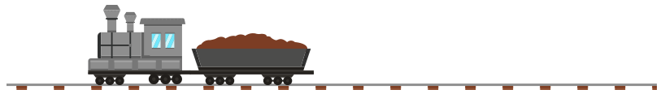

# Créez facilement vos animation HTML avec jCanvas
[](https://creativecommons.org/licenses/by-nc-nd/2.0/fr/legalcode)

_Sébastien Colas_

**Le « Canvas » permet l’affichage de graphismes 2D et 3D à l’aide de JavaScript au sein d’une page HTML5. Il n’est pas toujours facile d’écrire le code JavaScript afférant au Canvas, c’est pour cela que je vous propose de découvrir la librairie jCanvas qui simplifie grandement l’écriture du code.**

Dans cette article, je vous propose de coder un train composé d’une locomotive et d’un wagon, le tout roulant sur des rails. On pourra agir sur le train via des glisser-déposer et on animera le train.

## 1 Création de la page HTML
La toute première chose à faire est de se créer un répertoire de travail et d’y importer ce dont nous avons besoin. En lisant la documentation `jCanvas` [[1]](#link_1) , on découvre que la seule dépendance est `jQuery` [[2]](#link_2). 

```
mkdir jCanvasDemo
cd jCanvasDemo
mkdir js
mkdir img
wget https://code.jquery.com/jquery-3.3.1.min.js -O js/jquery-3.3.1.min.js
wget https://raw.githubusercontent.com/caleb531/jcanvas/v21.0.1/dist/min/jcanvas.min.js -O \
js/jcanvas.min.js
touch index.html
touch js/demo.js
```

Nous allons manipuler des images avec jCanvas, j’ai donc récupéré des images libres d’utilisation sur le site http://www.vecteezy.com. Je les ai modifié pour cet article :

```
wget http://colas.sebastien.free.fr/projets/jcanvas/ressources.zip
unzip ressources.zip
rm ressources.zip
```

Cela nous donne donc la structure suivante (commande `tree`) :

```
.
├── img
│   ├── infos.txt
│   ├── loco.png
│   ├── rails.png
│   └── wagon.png
├── index.html
└── js
    ├── demo.js
    ├── jcanvas.min.js
    └── jquery-3.3.1.min.js
```

Codons maintenant notre fichier principal `index.html` :
``` html
01: <!DOCTYPE html>
02: <html>
03:    <head>
04:        <script src="js/jquery-3.3.1.min.js"></script>
05:        <script src="js/jcanvas.min.js"></script>        
06:        <script src="js/demo.js"></script>
07:        <meta charset="UTF-8">        
08:        <title>Utilisation simplifiée de canvas HTML avec jCanvas</title>
09:    </head>
10:    <body>
11:        <h1>Utilisation simplifiée de canvas HTML avec jCanvas</h1>
12:        <canvas id="canvas1" width="800" height="140"></canvas>
13:    </body>
14: </html>
```

Ce document HTML est relativement simple. On notera l’utilisation des librairies `jQuery` en ligne `04`, ainsi que jCanvas en ligne `05`. Notre programme principal sera contenu dans le fichier `demo.js`, ligne `06`. La dernière partie importante se trouve en ligne `12` où nous déclarons notre `Canvas` qui aura comme identifiant `canvas1` et comme dimension 800x140 pixels.

Vous pouvez désormais tester la page HTML, rien de particulier ne s’affichera si ce n’est le titre.

## 2 Afficher une image

Commençons par afficher une simple image, en l’occurrence les rails sur lequel nous allons faire rouler notre train. Ajoutons les lignes suivantes au fichier `demo.js` :

``` javascript
01: $( document ).ready(function() {
02:     $('#canvas1').drawImage({
03:         source: 'img/rails.png',
04:         x: 0, y: 117
05:     });
06: });
```

On retrouve très souvent la ligne `01` dans le code `jQuery`. Cette ligne permet d’attendre que tout le document HTML soit chargé en mémoire avant de commencer à manipuler les composants s’y trouvant.

En ligne `02`, on recherche le Canvas dans la page à l’aide de son identifiant ici : `canvas1`. Ensuite, on utilise la fonction `drawImage` provenant de `jCanvas`. Comme son nom l’indique, cette fonction permet d’afficher une image.

Les lignes `03` et `04` sont les paramètres passés à la fonction `drawImage`. source nous permet de définir la localisation de l’image que l’on veut utiliser et `x,y` sa position dans le `Canvas`. On notera que l’origine des coordonnées du Canvas se situe en haut à gauche.
Lors du test, on verra effectivement s’afficher nos rails, mais seulement en partie. Par défaut, dans `jCanvas`, le centre de l’image est utilisé comme point d’origine.

## 3 Afficher des images sur différents plans (couches)

Modifions notre code de la façon suivante :

``` javascript
01: $( document ).ready(function() {
02:     $('#canvas1').drawImage({
03:         source: 'img/rails.png',
04:         x: 0, y: 117,
05:         fromCenter: false
06:     }).drawImage({
07:         source: 'img/loco.png',
08:         x: 100, y: 20,
09:         fromCenter: false
10:     });
11: });
```

La première modification est en ligne `05` où l’on dit à `jCanvas` de ne plus prendre le centre de l’image comme origine, mais bien de prendre la partie en haut à gauche. De cette façon, l’origine de notre image et du Canvas sera la même (en haut à gauche)

Le deuxième modification se situe sur les lignes `06` à `10`. On fait un nouvel appel à `drawImage` sur le résultat du `drawImage` précédent. Ceci est très pratique, car cela évite de répéter le code `jQuery` de sélection du composant : `$('#canvas1')`.

Si rien n’est spécifié, jCanvas empilera les images les unes sur les autres. La locomotive apparaîtra devant les rails, c’est l’effet que nous recherchons.

## 4 Le glisser/déposer (drag & drop)

### 4.1 Glisser/déposer classique

Nous allons maintenant laisser la possibilité aux utilisateurs de bouger les images :

``` javascript
01: $( document ).ready(function() {
02:     $('#canvas1').drawImage({
03:         layer: true,
04:         source: 'img/rails.png',
05:         x: 0, y: 117,
06:         fromCenter: false
07:     }).drawImage({
08:         layer: true,
09:         source: 'img/loco.png',
10:         x: 100, y: 20,
11:         fromCenter: false,
12:         draggable: true
13:     });
14: });
```

Les premières modifications sont en lignes `03` et `08`, on spécifie à `jCanvas` que les 2 images sont indépendantes, car elles appartiennent à des plans différents (en anglais « layers »). Une modification sur une image n’aura donc pas d’impact sur l’autre.
Seconde modification la ligne `12` qui nous active le glisser-déposer sur la locomotive.

On va donc pouvoir déplacer notre locomotive. Vous pouvez faire le test. On voit bien que la locomotive s’affiche devant les rails. On voit aussi que la locomotive peut être déplacée n’importe où dans le Canvas.

### 4.2 Glisser/déposer avec restriction

Comme c’est un peu embêtant pour une locomotive de sortir de ses rails, jCanvas nous propose de restreindre le glisser-déposer sur l’axe horizontal ou vertical.

Nous allons restreindre le déplacement de notre locomotive sur l’axe des `x` :

``` javascript
        ,restrictDragToAxis: 'x'
```    

Cette ligne est à insérer entre les lignes `12` et `13` (on pourra mettre la virgule en ligne `12`).


## 5 Manipulation des couches (layers)

### 5.1 Manipulation simple

Attelons un wagon à notre locomotive :

``` javascript
01 $( document ).ready(function() {
02     $('#canvas1').drawImage({
03         layer: true,
04         source: 'img/rails.png',
05         x: 0, y: 117,
06         fromCenter: false
07     }).drawImage({
08         layer: true,
09         source: 'img/loco.png',
10         x: 100, y: 20,
11         fromCenter: false,
12         draggable: true,
13         restrictDragToAxis: 'x'
14     }).drawImage({
15         layer: true,
16         source: 'img/wagon.png',
17         x: 225, y: 55,
18         fromCenter: false,
19         draggable: true,
20         restrictDragToAxis: 'x'
21     });
22 });
```

Rien de plus simple, on rajoute un drawImage : lignes `14` à `21`.

Lors du test, on constate que la locomotive et le wagon restent bien sur les rails, mais qu’ils ne sont pas attachés. De plus, le wagon s’affiche devant la locomotive. Tout ceci est normal, car la locomotive et le wagon se trouvent sur deux couches différentes et le wagon étant déclaré après la locomotive il s’affichera au premier plan.

### 5.2 Manipulation multiple
Nous allons modifier notre code pour déplacer notre wagon en même temps que notre locomotive :

``` javascript
01: $( document ).ready(function() {
02:     $('#canvas1').drawImage({
03:         layer: true,
04:         source: 'img/rails.png',
05:         x: 0, y: 117,
06:         fromCenter: false
07:     }).drawImage({
08:         layer: true,
09:         source: 'img/loco.png',
10:         x: 100, y: 20,
11:         fromCenter: false,
12:         draggable: true,
13:         restrictDragToAxis: 'x',
14:         groups: ['train'],
15:         dragGroups: ['train']
16:     }).drawImage({
17:         layer: true,
18:         source: 'img/wagon.png',
19:         x: 225, y: 55,
20:         fromCenter: false,
21:         draggable: true,
22:         restrictDragToAxis: 'x',
23:         groups: ['train'],
24:         dragGroups: ['train']
25:     });
26: });
```

Comme nous voulons manipuler 2 éléments graphiques en même temps, nous allons les regrouper : c’est l’objet des lignes `14` et `23` où on déclare que la locomotive et le wagon font parti du groupe train. On notera que nos objets peuvent faire parti de plusieurs groupes (nous utiliserons cette fonctionnalité ultérieurement).

Maintenant que nous avons un groupe, il faut déclarer ce qui se passe si on déplace un membre de ce groupe. Les lignes `15` et `24` nous permettent d’effectuer notre glisser-déplacer sur des groupes d’éléments.

On peut désormais déplacer tout notre train en faisant un glisser-déplacer sur la locomotive ou le wagon.

## 6 Gestion des événements

### 6.1 Manipulation simple

Dans la vie réelle, c’est la locomotive qui tracte le wagon, il semble donc étrange qu’on puisse déplacer tout le train à l’aide du wagon. Modifions notre code de la façon suivante :

``` javascript
01: $( document ).ready(function() {
02:     $('#canvas1').drawImage({
03:         layer: true,
04:         source: 'img/rails.png',
05:         x: 0, y: 117,
06:         fromCenter: false
07:     }).drawImage({
08:         layer: true,
09:         source: 'img/loco.png',
10:         x: 100, y: 20,
11:         fromCenter: false,
12:         draggable: true,
13:         restrictDragToAxis: 'x',
14:         groups: ['train'],
15:         dragGroups: ['train']
16:     }).drawImage({
17:         layer: true,
18:         source: 'img/wagon.png',
19:         x: 225, y: 55,
20:         fromCenter: false,
21:         groups: ['train'],
22:         click: function(layer) {
23:           alert("Cliquer sur la locomotive pour bouger le train");
24:         }
25:     });
26: });
```

La première chose à faire est de désactiver le glisser-déposer sur le wagon, pour cela il suffit de supprimer la ligne `draggable: true,`. On supprimera aussi la ligne `restrictDragToAxis: 'x',`.

Ensuite, nous allons avertir l’utilisateur qu’il faut déplacer le train et non pas la locomotive. On décide donc d’afficher un message en cas de clic sur le wagon grâce aux lignes `22` à `24`.

### 6.2 Animation

Un fois notre train déplacé, nous aimerions qu’il retourne automatiquement à sa place. Voici donc ce que nous allons faire :

``` javascript
01: $( document ).ready(function() {
02:     $('#canvas1').drawImage({
03:         layer: true,
04:         source: 'img/rails.png',
05:         x: 0, y: 117,
06:         fromCenter: false
07:     }).drawImage({
08:         layer: true,
09:         source: 'img/loco.png',
10:         x: 100, y: 20,
11:         fromCenter: false,
12:         draggable: true,
13:         restrictDragToAxis: 'x',
14:         groups: ['train','loco'],
15:         dragGroups: ['train'],
16:         dragstop: function (layer)
17:         {
18:                 $('canvas').animateLayerGroup('loco',  { x: 100 }, 500)
19:                            .animateLayerGroup('wagon', { x: 225 }, 500);
20:         }
21:     }).drawImage({
22:         layer: true,
23:         source: 'img/wagon.png',
24:         x: 225, y: 55,
25:         fromCenter: false,
26:         groups: ['train','wagon'],
27:         click: function(layer) {
28:                 alert("Cliquer sur la locomotive pour bouger le train");
29:         }
30:     });
31: });
```

Tout d’abord, nous allons dire que notre locomotive fait parti des groupes train et loco en ligne `14`.

De même pour notre wagon qui fera parti des groupes train et wagon en ligne `26`.

Il ne nous reste plus qu’à animer notre locomotive et notre wagon pour qu’ils retournent automatiquement à leurs places en cas de glisser-déposer. C’est l’objet des lignes `16` à `20`. Lorsque l’on dépose le train, la fonction `dragstop` est exécutée. Grâce à `animateLayerGroup`, nous allons pouvoir déplacer nos groupes. La fonction prend comme argument : le groupe à déplacer : `'loco'`, l’action à réaliser sur le groupe : ici, `x:100` on veut que `x` varie de la valeur actuelle à la valeur `100` et le temps pour effectuer l’action, ici `500 ms`. On répète l’opération pour le wagon.

Et voilà notre train retournera automatiquement à sa place en cas de glisser-déposer, il est possible qu’il y ait un léger décalage entre la locomotive et le wagon lors de se déplacement, car les 2 objets sont gérés par 2 animation différentes.



## Conclusion

Dans cet article, nous avons vu avec quelle facilité on peut manipuler le Canvas HTML à l’aide de la librairie jCanvas. Nous n’avons pas pu aborder toutes les fonctionnalités de jCanvas, mais les fonctionnalités les plus importantes on été couvertes. À vous maintenant d’enrichir votre site web de magnifiques Canvas à l’aide de la librairie jCanvas...

## Références

<a name="link_1"></a>[1] Adresse du site officiel jCanvas : https://projects.calebevans.me/jcanvas/

<a name="link_2"></a>[2] Adresse du site officiel jQuery : https://jquery.com/

<a name="link_3"></a>[3] Pack d’images utilisé pour cet article : https://www.vecteezy.com/vector-art/152765-caboose-free-vector-pack