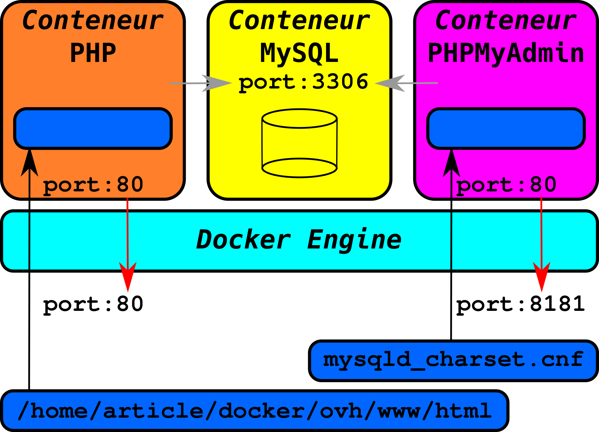

# Créer son environnement de développement PHP grâce à Docker Compose

[](https://creativecommons.org/licenses/by-nc-nd/2.0/fr/legalcode)

_Sébastien Colas_

Il est souvent chose ardue de maintenir son environnement de développement. Lors d’un travail d’équipe on doit aussi s’assurer que tous les développeurs ont le même environnement. Aujourd’hui les conteneurs offrent une solution élégante à ces problèmes récurrents. Nous allons voir dans cette article comment mettre en œuvre un environnement de développement LAMP (Linux+Apache+MySQL+PHP) à l’aide de Docker Compose.

Grâce aux containers je suis sûr de pouvoir reproduire exactement le même environnement. Pour mon environnement de développement je vais avoir besoin de plusieurs containers : un container pour PHP qui hébergera mon code, un container pour ma base de données MySQL et un dernier container pour PHPMyAdmin pour administrer ma base de données. Docker Compose me permet de décrire simplement ces containers ainsi que leurs relations.



## 1 Environnement de développement cible
Avant toute chose il faut définir parfaitement l’environnement que l’on souhaite créer. Dans cette article nous allons essayer de nous rapprocher au maximum de l’environnement du fournisseur OVH (offre mutualisée) incluant PHP & MySQL. Cela nous permettra de développer notre application localement et de la déployer ensuite chez OVH.

Voici donc la liste des conteneurs que nous souhaitons créer :
- Un conteneur PHP7 : Conteneur le plus complexe à créer car il doit est au plus proche de l’environnement OVH.
- Un conteneur MySQL : La version de la base de données pourra être plus à jour que celle d’OVH.
- Un conteneur PHPMyAdmin : Conteneur pour le confort d’administration de la base de données.
Pour décrire la configuration de ces différents conteneurs ainsi que leur interaction Docker Compose se base sur un fichier de configuration au format YAML. Voici le squelette que nous allons utiliser : 
Fichier `docker-compose.yml`

``` yaml
# Conteneur PHP nommé php
php:
  # Description du conteneur

# Conteneur MySQL nommé db (database)
db:
  # Description du conteneur

# Conteneur PhpMyAdmin nommé phpmyadmin
phpmyadmin:
  # Description du conteneur
```

Nous allons aborder les conteneur les uns après les autres du plus simple au plus complexe : `db`, `phpmyadmin`, `php`.

## 2 Le Conteneur MySQL

Voici la description du container `db` :

``` yaml
db:
  image: mysql
  environment:
    MYSQL_ROOT_PASSWORD: Secret
    MYSQL_DATABASE: mydb
    MYSQL_USER: mydb_user
    MYSQL_PASSWORD: mydb_password
  volumes:
    - /home/article/docker/ovh/mysqld_charset.cnf:/etc/mysql/conf.d/mysqld_charset.cnf
```   

Examinons les mots clefs suivants : `image`, `environment` et `volumes`.

Tout d’abord `image` permet de créer notre conteneur à l’aide de l’image officiel mysql sur le hub docker. [[1]](#link_1)

Pour que notre base de données MySQL fonctionne correctement, il faut un certain nombre d’information tel que le mot de passe administrateur, le nom de la base a créer, ainsi qu’un utilisateur/mot de passe. C’est ce que nous permet la section environment avec les variables d’environnement  `MYSQL_ROOT_PASSWORD`,  `MYSQL_DATABASE`,  `MYSQL_USER`,  `MYSQL_PASSWORD`. On retrouve la description de ces variables dans la documentation officielle. [[1]](#link_1)

Cela pourrait suffire, mais pour être compatible avec l’environnement OVH il faut que l’encodage des caractères au niveau de la base soit `uft8`, ce qui n’est pas le cas par défaut. C’est l’objet du mot clef volumes qui permet d’exporter des fichiers ou répertoires du système de fichier local (dans notre cas `/home/article/docker/ovh/mysqld_charset`.cnf) vers le conteneur (dans notre cas `/etc/mysql/conf.d/mysqld_charset.cnf`).

Voici le contenu du fichier de configuration mysql : `mysqld_charset.cnf`

```
[mysqld]
character_set_server=utf8
character_set_filesystem=utf8
collation-server=utf8_general_ci
init-connect='SET NAMES utf8'
init_connect='SET collation_connection = utf8_general_ci'
skip-character-set-client-handshake
```

## 3 Le Conteneur PhpMyAdmin

Voici la description du container phpmyadmin :

``` yaml
phpmyadmin:
  image: phpmyadmin/phpmyadmin
  links:
    - db
  ports:
    - 8181:80
  environment:
    MYSQL_USERNAME: root
    MYSQL_ROOT_PASSWORD: Secret
```

La section `image` nous permet de créer un conteneur avec l’image officielle de PhpMyAdmin. [[2]](#link_2)

La section `environment` nous permet de définir l’utilisateur et le mot de passe de l’administrateur MySQL. Attention de bien mettre les même informations que dans le conteneur `db`.

La section `links` nous permet de relier le conteneur à notre conteneur base de données. En effet le conteneur `phpmyadmin` a besoin de connaître la localisation de la base (dans notre cas le conteneur `db`).

Pour finir la section `ports` permet de lier notre conteneur à notre machine local. Le premier paramètre est le port local (ici `8181`), le second paramètre est le port dans le conteneur (ici `80`). Nous pourrons donc accéder à PhpMyAdmin en tapant l’url : http://localhost:8181

## 4 Le Conteneur PHP

Voici la description du conteneur php :

``` yaml
php:
  build: ./engine/php_server/
  ports:
    - 80:80
  volumes:
    - /home/article/docker/ovh/www/html:/var/www/html
  links:
    - db
  dns:
    - 208.67.222.222
    - 208.67.220.220
```

Un gros changement pour commencer, le mot clef `build` est à la place d’`image`. En effet build va nous permettre de configurer plus finement notre image docker, c’est ce que nous verrons en détail ultérieurement.

La section `port` nous permet d’accéder au port `80` de notre conteneur en utilisant le port local `80` (on suppose ici que le port est disponible). Nous pourrons donc accéder à notre conteneur `php` en tapant l’url : http://localhost

Nous allons développer dans le répertoire : `/home/article/docker/ovh/www/html`, on va donc exporter se répertoire local vers le répertoire hébergeant le contenu web de notre conteneur php : `/var/www/html`, c’est ce qui est fait ici dans la section `volumes`.

Notre programme PHP devra accéder à la base de données, pour se faire on utilisera le nom de machine `db`. La section `links` nous permet cela.

Pour finir la section `dns` nous permet de définir les serveurs DNS utilisés au sein du conteneur, ici nous utiliseront les serveur OpenDNS : `208.67.222.222`, `208.67.220.220`.

## 5 Configuration avancée du conteneur PHP

Dans la définition du conteneur php nous avons écrit : `build: ./engine/php_server/`.

Cela signifie que nous voulons utiliser un fichier Dockerfile situé dans le répertoire : `./engine/php_server/`. Voici le contenu de ce fichier :

``` docker
FROM php:7.1-apache
RUN apt-get update \
    && apt-get install -y \
        libpng-dev \
        aptitude \
        libfreetype6-dev \
        libjpeg62-turbo-dev \
        libmcrypt-dev \
        libbz2-dev \
        libgmp-dev \
        libzip-dev \
        libc-client-dev \
        libkrb5-dev \
        libpspell-dev \
        libmagickwand-dev \
        libxslt-dev --no-install-recommends \
    && rm -r /var/lib/apt/lists/*
RUN docker-php-ext-configure imap --with-kerberos --with-imap-ssl
RUN docker-php-ext-configure gd   --with-freetype-dir=/usr/include/ \
                                  --with-jpeg-dir=/usr/include/
RUN docker-php-ext-install -j$(nproc) \
        mysqli exif mbstring zip dba bz2 calendar bcmath gettext gmp intl pdo pdo_mysql pspell gd \
        imap iconv mcrypt soap sockets sysvmsg sysvsem sysvshm wddx xmlrpc xsl
RUN pecl install imagick && docker-php-ext-enable imagick
RUN pecl install -o -f redis \
    &&  rm -rf /tmp/pear \
    &&  docker-php-ext-enable redis
RUN a2enmod rewrite
```

Regardons un peu notre fichier de configuration Docker.

Le mot clef `FROM` nous permet de sélectionner l’image docker à personnaliser, ici `php:7.1-apache`. [3]

Une fois l’image téléchargée localement nous allons la personnaliser. Le mot clef `RUN` nous permet d’exécuter des commandes au sein du conteneur, regardons nos différentes commandes :

- `apt-get update` : Mise à jour des packages
- `apt-get install -y --no-install-recommends` : Installation des packages sans les recommandations.
- `docker-php-ext-*` : Commandes interne au conteneur PHP permettant la configuration, l’installation, l’ativation d’extension PHP. [3]
- `pecl install` : Installation d’extensions PHP
- `a2enmod` : Activation de module apache

## 6 Démarrage et vérification des conteneurs

Une fois notre configuration effectuée, il faut démarrer les conteneurs :

``` bash
$ sudo docker-compose up
```

Il faut être patient car docker compose va télécharger les images docker à partir du Hub Docker.

Une fois les images présentes, le démarrage des conteneurs `phpmyadmin` et `db` démarrent rapidement.

Pour le conteneur `php` c’est plus long, cela est dû à notre personnalisation.

Pour arrêter nos trois conteneurs il suffit de taper `<ctrl>-c` dans notre terminal.

Pour relancer les container on relance la même commande :
``` bash
$ sudo docker-compose up
```
On peut à l’aide des commandes docker vérifier que tout fonctionne :

```
sudo docker ps

CONTAINER ID        IMAGE                   COMMAND                  CREATED             STATUS              PORTS                  NAMES
0094bc324ab4        phpmyadmin/phpmyadmin   "/run.sh phpmyadmin"     6 hours ago         Up 28 minutes       0.0.0.0:8181->80/tcp   ovh_phpmyadmin_1
012f6f125a5d        ovh_php                 "docker-php-entryp..."   6 hours ago         Up 28 minutes       0.0.0.0:80->80/tcp     ovh_php_1
841469a3623f        mysql                   "docker-entrypoint..."   6 hours ago         Up 28 minutes       3306/tcp               ovh_db_1
```

Les `CONTAINER ID` sont générés par docker, les vôtres seront probablement différents.

## Conclusion

Dans cette article nous avons vu comment décrire un environnement de développement PHP basé sur plusieurs conteneurs docker à l’aide de Docker Compose. Cette environnement se rapproche très fortement de l’environnement de production offre mutualisée d’OVH. 

Nous pouvons constater les différences entre notre environnement Docker Compose et l’environnement OVH avec le fichier `/home/article/docker/ovh/www/html/infos.php` :

``` php
<?php
phpinfo()
?>
```

Nous pouvons désormais très facilement distribuer notre environnement en étant sûr qu’il sera recréé à l’identique.

## Références

<a name="link_1"></a> [1] Page officiel du conteneur Mysql sur le Hub Docker: https://hub.docker.com/_/mysql/

<a name="link_2"></a> [2] Page officiel du conteneur PhpMyAdmin sur le Hub Docker: https://hub.docker.com/r/phpmyadmin/phpmyadmin/

<a name="link_3"></a>[3] Page officiel du conteneu PHP sur le Hub Docker : https://hub.docker.com/_/php/
