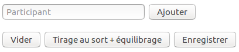
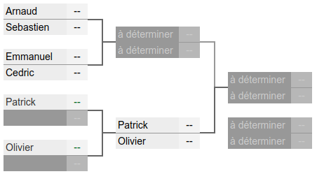
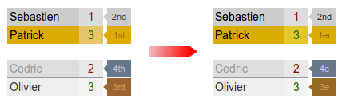
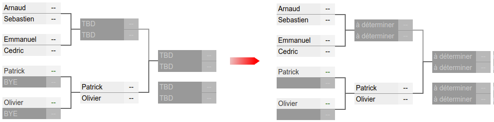
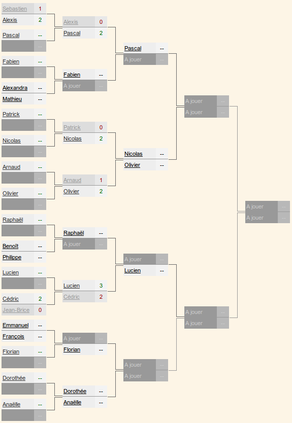

# Créer vos feuilles de tournoi avec jQuery Bracket

[](https://creativecommons.org/licenses/by-nc-nd/2.0/fr/legalcode)

_Sébastien Colas_

Lorsque l’on organise des tournois il est souvent intéressant de mettre les résultats en ligne et de pouvoir les modifier aisément. Dans cet article nous allons utiliser la librairie jQuery Bracket pour publier des feuilles de tournoi. Nous ajouterons aussi notre propre code pour rendre l’utilisation de la librairie plus facile.


# 1 Préparation de la page HTML



Nous allons utiliser la librairie jQuery Bracket dont le site se trouve à l’adresse suivante : http://www.aropupu.fi/bracket/ [[1]](#link_1)

Préparons notre environnement de travaille et récupérons les librairies dont nous avons besoin.

``` bash
$ mkdir tournoi
$ cd tournoi
$ mkdir js
$ mkdir css
$ mkdir php
$ cd js
$ wget https://code.jquery.com/jquery-3.3.1.min.js
$ wget https://raw.githubusercontent.com/teijo/jquery-bracket/master/dist/jquery.bracket.min.js
$ touch tournoi.js
$ cd ../css
$ wget https://raw.githubusercontent.com/teijo/jquery-bracket/master/dist/jquery.bracket.min.css
$ cd ..
$ touch index.html
```

Cela nous donne donc la structure suivante (commande tree) :
```
.
├── css
│   └── jquery.bracket.min.css
├── index.html
├── js
│   ├── jquery-3.3.1.min.js
│   ├── jquery.bracket.min.js
│   └── tournoi.js
└── php
```

Tout est prêt, créons maintenant notre page HTML index.html :

``` html
01: <!DOCTYPE html>
02: <html>
03:     <head>
04:         <title>jQuery Bracket</title>
05:         <meta charset="UTF-8">
06:         <meta name="viewport" content="width=device-width, initial-scale=1.0">
07:         <script type="text/javascript" src="js/jquery-3.3.1.min.js"></script>
08:         <script type="text/javascript" src="js/jquery.bracket.min.js"></script>
09:         <script type="text/javascript" src="js/tournoi.js"></script>
10:         <link rel="stylesheet" type="text/css" href="css/jquery.bracket.min.css" />        
11:     </head>
12:     <body>
13:         <input type="text" id="participant" placeholder="Participant"> 
14:         <button id="ajouter">Ajouter</button><br><br>
15:         <button id="vider">Vider</button>
16:         <button id="aleatoire">Tirage au sort + équilibrage</button> 
17:         <button id="enregistrer">Enregistrer</button>
18:         <div id="tournoi"></div>
19:     </body>
20: </html>
```

Voici les explications des lignes les plus importantes :

| Lignes      | Explication |
| ----------- | ----------- |
| 7,8,9       | Déclaration des librairies que nous utiliserons dans notre projet. Tout d’abord la librairie `jquery-3.3.1.min.js` est un pré-requis à la seconde librairie `jquery.bracket.min.js` (c’est la librairie qui nous intéresse). Pour finir notre programme principal tounois.js qui pour le moment est vide. |
| 13          | Zone de texte permettant d’ajouter un joueur à notre tournoi. |
| 14          | Bouton permettant d’ajouter le joueur à notre tournoi. |
| 15          | Bouton permettant de ré-initialiser notre feuille de tournoi. |
| 16          | Bouton permettant une fois tous les joueurs saisis de faire un tirage aléatoire. |
| 17          | Bouton permettant d’enregistrer notre feuille de tournoi. |
| 18   | Zone où sera affichée notre feuille de tournoi. |

## 2 Affichage d’une feuille de tournoi



Tout d’abord écrivons un fichier d’exemple pour notre tournoi `js/resultats.json`:

``` javascript
01: {
02:   "teams":[
03:       [ "Arnaud",   "Sebastien" ],
04:       [ "Emmanuel", "Cedric"    ],
05:       [ "Patrick",  null        ],
06:       [ "Olivier",  null        ]
07:   ],   
08:   "results":[]
09: }
``` 

Nous avons 6 joueurs et pas encore de résultats.

Attaquons nous au programme principal `js/tournoi.js` :

``` javascript
01: infos={};
02: 
03: function sauver() {} // A suivre...
04: function ajoute_participant() {} // A suivre...
05: function tirage_aleatoire() {} // A suivre...
06: function enregistrer() {} // A suivre...
07: function vider() {} // A suivre…
08: 
09: function edit_fn(container, data, doneCb) { }
10: function render_fn(container, data, score, state) {
11:   switch(state) {
12:     case "empty-bye":
13:       return;
14:     case "empty-tbd":
15:       container.append("à déterminer");
16:       return;
17:     case "entry-no-score":
18:     case "entry-default-win":
19:     case "entry-complete":
20:       container.append(data);
21:       return;
22:   }
23: }
24: 
25: function affiche_tournoi()
26: {
27:     fr={"1st":"1er",
28:         "2nd":"2nd",
29:         "3rd":"3e",
30:         "4th":"4e"};
31: 
32:     $('#tournoi').bracket(
33:         {   teamWidth: 90,
34:             disableToolbar:true,
35:             disableTeamEdit:true,
36:             centerConnectors:true,
37:             init: infos,
38:             save:sauver ,
39:             decorator: {edit: edit_fn, render: render_fn}
40:         });
41: 
42:     $(".bubble").each(function(index,element){
43:         $(element).html(fr[$(element).html()]);
44:     });
45: }
46: 
47: $(document).ready(function(){
48:     $.ajaxSetup({ cache: false });
49:     $.getJSON( "js/resultats.json", function( data ) {
50:         infos=data;
51:         affiche_tournoi();
52:     });   
53:         
54:     $("#ajouter").click(ajoute_participant);
55:     $("#aleatoire").click(tirage_aleatoire);
56:     $("#enregistrer").click(enregistrer);
57:     $("#vider").click(vider);
58: });    
```

Nous allons utiliser une variable globale pour maintenir nos informations de tournoi (i.e. `joueurs` et `scores`), il s’agit de la variable infos initialisée à vide en ligne `1`.

Des lignes `03` à `07`, nous définissons tout un certain nombre de fonctions que nous développerons plus tard, ici le corps de la fonction est vide pour éviter des erreurs dans la console JavaScript.

## 1.1 Le programme principal (lignes `47` à `60`)

En ligne `47` nous attendons que notre page HTML soit prête (`ready`) pour exécuter notre programme.

En ligne `48` nous désactivons le cache sur les requêtes AJAX. En effet les données relatives au tournoi seront stockées dans un fichier externe qui sera modifié régulièrement : `resultats.json`.

Des lignes `49` à `52` nous effectuons un appel AJAX pour accéder au fichier JSON précédemment cité. La réponse est stockée dans la variable infos, puis l’affichage est déclenché avec la fonction affiche_tournoi décrite plus loin.

Enfin des lignes `54` à `57` nous associons des fonctions aux cliques sur les différents boutons.

## 1.2 Affichage du tournoi (lignes `25` à `45`)

Malheureusement jQuery Bracket ne connaît pas le français, il faut donc faire quelques adaptations pour lui apprendre la langue. Des lignes `27` à `30` nous créons notre tableau de conversion Anglais vers Français. Nous nous servirons de ce tableau en lignes `42` à `44`. Dans ce lignes nous récupérons toutes les éléments de la page HTML de la classe bubble et pour chaque élément trouvé nous effectuons la traduction.



Les lignes `32` à `40` nous permette d’afficher notre feuille de tournoi. Voici plus de détails :

| Lignes      | Explication |
| ----------- | ----------- |
| 33          | Élargissement de la largeur d’affichage des noms (certains prénoms dépassaient de la zone) |
| 34          | Désactivation de la barre d’outils incluse dans jQuery Bracket. (nous utiliserons la notre) |
| 35          | Désactivation de l’édition des noms saisis. Notre outils permettra d’ajouter des noms. |
| 36          | Centrage des connections entre les différentes cases. |
| 37          | Informations à afficher, nous utiliserons notre variable globale infos. |
| 38          | Déclaration de la fonction à appeler lorsque l’on saisit un score dans le tableau, ici sauver. |
| 39          | Utilisation des fonctions permettant de personnaliser le visuel. |

## 1.3 Personnalisation de l’affichage (lignes `9` à `23`)

En Ligne `9` la fonction `edit_fn` permet de personnaliser l’édition d’un score. Ici nous ne voulons pas de personnalisation, nous allons donc laisser la fonction vide.

En Line `10` la fonction `render_fn` permet de personnaliser le contenu des cases :

| Ligne | Valeur par défaut | Replacé par |
| ----- | ----------------- | ----------- |
| 12    | BYE               | vide |
| 15    | TBD               | « à déterminer » |



## 3 Menu personnalisé

Les fonctions que nous allons déclarer dans cette section remplaceront les fonctions vides du fichier `tournois.js`.

### 3.1 Vider la feuille de tournoi

Voici le code permettant de vider la feuille de tournoi :

``` javascript
01: function vider() {
02:     infos={"teams":[], "results":[]};
03:     affiche_tournoi();
04: }
```

La fonction est très simple on vide la liste des joueurs ainsi que les résultats et on ré-affiche.

### 3.2 Ajouter un joueur

Voici le code permettant de rajouter un joueur à la feuille de tournoi :

``` javascript
01: function liste_participants() {
02:     return infos.teams.flat().filter(function (el) {
03:             return el !== null;
04:         });
05: }
06: 
07: function ajoute_participant() {
08:     if ((infos.results.length !== 0) || ($("#participant").val()==="")) return;
09:     if (infos.teams.length===0) {
10:         infos.teams.push([$("#participant").val(),null]);
11:     } else {
12:         var participants=liste_participants();
13: 
14:         participants.push($("#participant").val());
15:         var racine_2=Math.ceil(Math.log2(participants.length));
16: 
17:         var complement=Math.pow(2,racine_2)-participants.length;
18:         for (i=0;i<complement;i++) {
19:             participants.push(null);
20:         }
21: 
22:         var retour=[];
23:         for (i=0;i<participants.length;i=i+2) {
24:             retour.push([participants[i],participants[i+1]]);
25:         }
26: 
27:         infos.teams=retour;
28:     }
29:     affiche_tournoi();
30:     $("#participant").val("");
31: }
```

Le problème principal de la librairie jQuery Bracket c’est qu’elle ne fonctionne qu’avec un nombre de joueurs étant un carré : 2n. Nous allons donc créer un programme qui accepte n’importe quel nombre de joueur.

De la ligne 01 à 05 on crée la fonction liste_participants qui a pour but de créer une liste de participants à partir de la liste jQuery Bracket, exemple :
``` json
         [["Arnaud","Sebastien"],["Emmanuel","Cedric"],["Patrick",null],["Olivier",null]]
flat   => ["Arnaud","Sebastien",  "Emmanuel","Cedric",  "Patrick",null,  "Olivier",null]
filter => ["Arnaud","Sebastien",  "Emmanuel","Cedric",  "Patrick",       "Olivier"     ]
```

Examinons maintenant la fonction ajoute_participant :

| Lignes      | Explication |
| ----------- | ----------- |
| 08          | Dans le cas où il y a déjà des scores ou qu’il n’y a pas de nom à ajouter on ne fait rien. |
| 09,10       | Si la liste est vide créons une liste composée d’un joueur : `[["nom_joueur",null]]` |
| 12          | Création d’une liste simple avec tous les joueurs : `participants` |
| 14          | Ajout du joueur saisi dans le formulaire à la fin de la `liste participants` |
| 15          | Calcul de la valeur `racine_2`  tel que `2^(racine_2) ≥ nb(participants) > 2^(racine_2-1)`  |
| 17          | Calcul du nombre de joueurs manquants pour obtenir une puissance de 2 : `complement`. |
| 18,19       | Complément de la liste des joueurs avec des `null` à l’aide du `complement`. |
| 22 à 25     | Création d’une liste compréhensible par jQuery Bracket |
| 27          | Mise à jour de la variable globale `infos.teams`. |
| 29          | Affichage de la feuille de tournoi pour tenir compte des modifications. |
| 30          | Suppression du nom du joueur dans le formulaire pour éviter les doublons. |

Voici un exemple d’exécution :

```
Ligne 12 =>  ["Arnaud","Sebastien",  "Emmanuel","Cedric",  "Patrick","Olivier"]
Ligne 19 =>  ["Arnaud","Sebastien",  "Emmanuel","Cedric",  "Patrick","Olivier",  null,null]
Ligne 27 => [["Arnaud","Sebastien"],["Emmanuel","Cedric"],["Patrick","Olivier"],[null,null]]
```

### 3.3 Tirage au sort des matchs

Attaquons nous maintenant au code permettant de tirer au sort les différents matchs du tournoi :

``` javascript
01: function shuffle(a) {
02:     var j, x, i;
03:     for (i = a.length - 1; i > 0; i--) {
04:         j = Math.floor(Math.random() * (i + 1));
05:         x = a[i];
06:         a[i] = a[j];
07:         a[j] = x;
08:     }
09:     return a;
10: }   
11:     
12: function tirage_aleatoire()
13: {
14:     if (infos.results.length !== 0) return;
15:     var participants=liste_participants(); 
16:     participants=shuffle(participants);   
17:     
18:     var retour=[];
19:     var nb_matchs=infos.teams.length;
20:     
21:     for (i=0;i<nb_matchs;i++)
22:     {
23:         if(participants[i+nb_matchs]) {
24:             retour.push([participants[i],participants[i+nb_matchs]]);
25:         } else {
26:             retour.push([participants[i],null]);
27:         }        
28:     }   
29:     infos.teams=retour;
30:     affiche_tournoi(); 
31: }   
```

En ligne `1`, la fonction shuffle permet de mélanger les éléments d’un tableau JavaScript. Le code provient du site StackOverflow. [[2]](#link_2)

En ligne `12`, la fonction tirage_aleatoire nous permet le tirage au sort des différents matchs. Voyons plus en détail son fonctionnement :

| Lignes      | Explication |
| ----------- | ----------- |
| 14          | Si il y a déjà des scores il est impossible de modifier les matchs. |
| 15,16       | On récupère la liste des participants que l’on mélange aléatoirement à l’aide des fonctions `liste_participants` et `shuffle`. |
| 18          | création de la variable qui contiendra le résultat du tirage au sort : `retour` |
| 19          | Récupération du nombre de match dans la variable : `nb_matchs` |
| 21 à 28     | Création de la feuille de tournoi au format jQuery Bracket (voir exemple après le tableau) |
| 29,30       | Enregistrement du résultat dans la variable globale `infos` et on `affichage affiche_tournoi()`. |

Voici un exemple de la création de la feuille de tournoi au format jQuery Bracket (lignes 21 à 28) :

```
                 0         1           2         3         4         5
participants=["Arnaud","Sebastien","Emmanuel","Cedric","Patrick","Olivier"]
nb_matchs=4
i=0 => retour=[["Arnaud","Patrick"]] indices 0(i) et 4(i+nb_matchs)
i=1 => retour=[["Arnaud","Patrick"],["Sebastien","Olivier"]] indices 1(i) et 5(i+nb_matchs)
i=2 => retour=[["Arnaud","Patrick"],["Sebastien","Olivier"],["Emmanuel",null]]
i=3 => retour=[["Arnaud","Patrick"],["Sebastien","Olivier"],["Emmanuel",null],["Cedric",null]]
```

### 3.4 Enregistrer la feuille de tournoi

Voici le code permettant d’enregistrer les modifications de la feuille de tournoi :

``` javascript
  1 function sauver(data) {
  2     infos=data;
  3     affiche_tournoi();
  4 }
  5 
  6 function enregistrer() {
  7     $.ajax({
  8         async:true,
  9         type:"POST",
 10         url:"/php/enregistre.php",
 11         data:JSON.stringify(infos),
 12         datatype:"json",
 13         success: function(){alert("Enregistrement réussi");},
 14         error: function(){alert("Impossible d'enregistrer");}
 15     });
 16 }
```

La fonction `sauver` récupère les données renvoyées par jQuery Bracket et de les sauvegarde dans la variable globale `infos`, ensuite ré-affichons la feuille de tournoi.

La fonction enregistrer effectue un POST HTTP sur l’url `/php/enregistre.php` et passe en argument le `infos` au format JSON à l’aide de la fonction `JSON.stringify`.

## 4 Enregistrer la feuille de tournoi côté serveur

Dans cette section nous allons implémenter la partie serveur. Dans notre exemple nous utiliserons PHP.

Cette partie étant en dehors de l’utilisation de la librairie jQuery Backet nous allons nous contenter d’un « quick & dirty » (« vite fait, mal fait »).

Voici donc le code de `php/enregistre.php` :

``` php
  1 <?php
  2 /*****************************
  3  * ATTENTION A SECURISER !!! *
  4  * NE PAS UTILISER EN L'ETAT *
  5  *****************************/
  6 
  7 $params = file_get_contents("php://input");
  8 $json=json_decode($params, true);
  9 
 10 $file = '../js/resultats.json';
 11 file_put_contents($file, $params);
 12 ?>
```

Le programme récupère des données HTTP POST en ligne `7`, les convertit au format JSON en ligne `8` et écrit le résultat dans le fichier `../js/reusltats.json` en lignes `10` et `11`.

## Conclusion



Et Voilà !!! Nous avons créé tout le nécessaire pour pouvoir aisément créer notre feuille de tournoi à l’aide de notre formulaire.

Pour aller plus loin je vous invite à lire la documentation officielle de jQuery Bracket [[1]](#link_1), vous y apprendrez par exemple comment :

- personnaliser votre affichage
- ajouter une consolante à votre tournoi
- créer un tournoi à double élimination

Pour finir il ne faudra pas oublier de sécuriser `php/enregistrer.php`.

Vous pourrez par exemple rajouter un accès authentifié et supprimer l’écriture fichier au profit d’un stockage en base de données.

## Références

<a name="link_1"></a> [1] Site officiel de jQuery Bracket : http://www.aropupu.fi/bracket/ 

<a name="link_2"></a> [2] Comment mélanger un tableau JavaScript sur le site StackOverflow: https://stackoverflow.com/questions/6274339/how-can-i-shuffle-an-array
