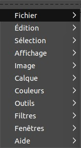
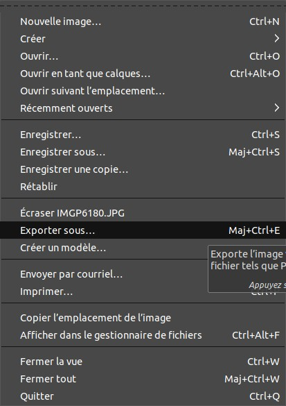

# Retoucher vos photographies avec Gimp avant leurs publications internet

_Sébastien Colas_

Dans cet article je vous propose quelques étapes très simples à réaliser pour avoir un rendu optimal sur vos photographies lors d’une publication sur un site web.

## 1 Recadrage

A moins d’être photographe professionnel les photos ont souvent des problèmes de cadrage.

Pour ma part j’opte pour un recadrage qui conserve les proportions de la photographie.

On sélectionne « Outil de découpage » dans les outils. Comme le but est de garder les proportions il faut cliquer sur « fixé » dans le menu. 

Dans la photographie d’exmple, le cœur de l’action se situe à gauche et le personnage de droite sur la photo originale déborde de la photographie donc autant le supprimer.

## 2 Réglage de la saturation

Par manque d’éclairage les photographies ont tendance à virer à l’orange. Pour corriger ce problème il faut modifier la saturation de l’image. Pour se faire on clique avec le bouton droit puis on sélectionne le menu « couleur » ensuite on sélectionne « teinte-Saturation ». Le menu de réglage apparaît alors et là le réglage est assez simple, il suffit de baisser la saturation (dans l’exemple -15,2). Pour se rendre compte en temps réel des modification je vous invite à cliquer sur « aperçu » et « éclater la vue ».

Sur la photo la partie gauche nous montre un aperçu du changement de la saturation, la partie droite nous montre l’image avant la correction. Certes les couleurs on l’air plus ternes après les modifications mais nous allons régler ce problème dans l’étape suivante.

## 3 Réglage des niveaux

Un autre effet du manque d’éclairage est d’avoir des photographies ternes/sombres. Pour corriger ce problème nous allons modifier les niveaux. Il faut donc faire un clique droit sur la photographie puis on sélectionne le menu « couleurs » ensuite on sélectionne « Niveaux... ». Le menu de réglage apparaît alors. Un histogramme nous permet de visualiser le couleurs du plus sombre an plus clair. Voici comment je fais mes réglages. Je ramène le niveau de sortie des couleurs claires (l’indexe de droite) à la fin des couleurs, cela éclaircira toute l’image. En générale il faut aussi éclaircir les couleurs médianes. Pour se faire on sélectionne l’indexe du milieu et on le décale vers la gauche. Comme d’habitude je vous conseille de cocher les menus « aperçu » et « éclater la vue » pour se rendre compte en temps réel du futur rendu.

Sur la photo voici un aperçu des modifications.

## 4 Redimensionnement

Avant de publier sur internet il est important d’avoir une dimension d’image correcte. Mon appareil photo crée des photographies d’une résolution de 5472x3648 ce qui est beaucoup trop pour une image internet. On fait donc un clique droit sur la photographie puis « Image » ensuite on sélectionne « Échelle et taille de l’image... ». Le menu de réglage apparaît alors. Je choisis en générale une largeur de 800px. L’intérêt de cette modification est de pouvoir afficher une image sur la page web avec un écran classique. Si par contre on dispose d’un écran 4K, on pourra alors afficher deux photographiques côte à côte.

## 5 Compression

La dernière étape consiste à réduire la taille du fichier image. Le mieux est d’opter pour un format d’image permettant une compression destructrice tel que le jpeg. Pour enregistrer notre photographie on clique droite sur l’image puis « Fichier », ensuite « Exporter sous ... » on donne un nom de fichier avec l’extension .jpg et pour finir le menu de réglage nous propose la qualité de l’image. Plus la qualité est faible plus l’image sera de petite taille mais plus la compression sera visible. Une qualité raisonnable se situe entre 70 et 90, le mieux c’est de faire des tests.

On peut voir sur la partie gauche de la photographie une faible qualité d’image.

## Conclusion
Voici donc 5 étapes très simples vous permettant de rapidement tirer le meilleur de vos photos en vue de les publier sur un site internet.