# Auto-héberger son calendrier avec Baïkal

[](https://creativecommons.org/licenses/by-nc-nd/2.0/fr/legalcode)

_Sébastien Colas_

Il est très utile de pouvoir avoir un calendrier partagé accessible à tout moment sur toute sorte de clients: PC, tablette, téléphone. La solution la plus simple est souvent d’utiliser Google Calendar. Dans cette article nous allons voir qu’il n’est pas si compliqué d’héberger soi-même un calendrier partagé à l’aide de Baïkal. Nous aborderons l’installation et la configuration de Baïkal. Pour finir nous aborderons la configuration des clients Thunderbird, Android et IOS.

### 1.1 Téléchargement de Baïkal

On télécharge d’abord Baïkal sur le site https://github.com/sabre-io/Baikal/releases :
```
$ wget https://github.com/sabre-io/Baikal/releases/download/0.5.3/baikal-0.5.3.zip
$ unzip baikal-0.5.3.zip
$ ls -l baikal
total 16
drwxr-xr-x 4 scolas scolas 4096 avril 23 15:55 Core
drwxr-xr-x 4 scolas scolas 4096 juin  17 19:10 html
drwxr-xr-x 3 scolas scolas 4096 mai   13 16:25 Specific
drwxr-xr-x 7 scolas scolas 4096 mai   13 16:26 vendor
```

La documentation nous apprend que seul le répertoire html doit être accessible et que les autres répertoires doivent être inaccessible pour éviter toute faille de sécurité.

### 1.2 Configuration du site d’hébergement

Nous allons voir comment installer Baïkal chez l’hébergeur OVH. Une manipulation similaire sera a effectuer chez d’autres hébergeurs.

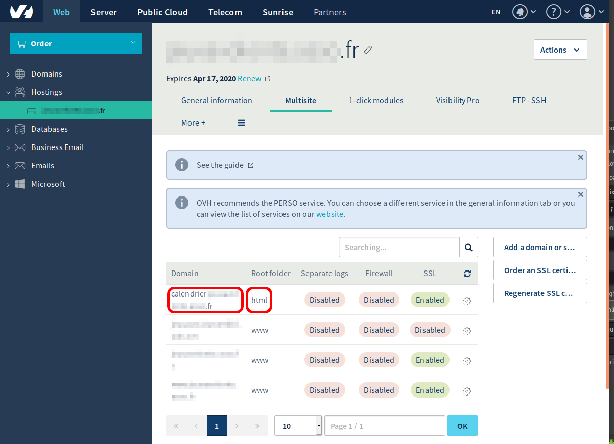

Pour l’installation de Baïkal le plus simple est donc de créer un sous domaine à l’aide de la console OVH comme par exemple http://calendrier.monsite.fr et de positionner le répertoire racine du site à html.

### 1.3 Envoie des fichiers

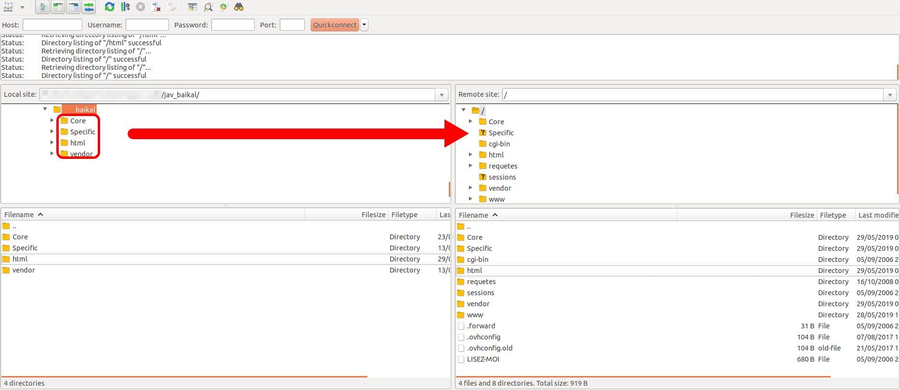

L’étape suivante consiste à envoyer les fichiers sur le site de l’hébergeur. Nous pouvons transférer les fichiers à l’aide d’un client FTP tel que Filezilla.

## 2 Installer et configurer Baïkal

### 2.1 Installer Baïkal

Accèdons ensuite au site pour effectuer l’installation : https://calendrier.monsite.fr

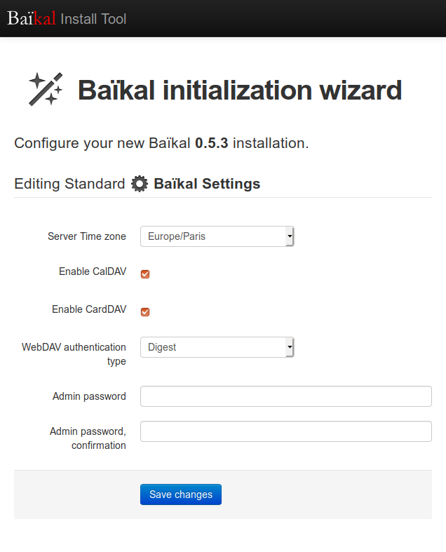

On choisit le fuseau horaire sur lequel on se trouve dans notre cas Europe/Paris.

On active CalDav (la partie gestion de calendrier) et CardDav (la partie gestion de carnet de contact). Au niveau de l’authentification nous laisserons la valeur par défaut digest.

Finalement nous spécifions le mot de passe administrateur.

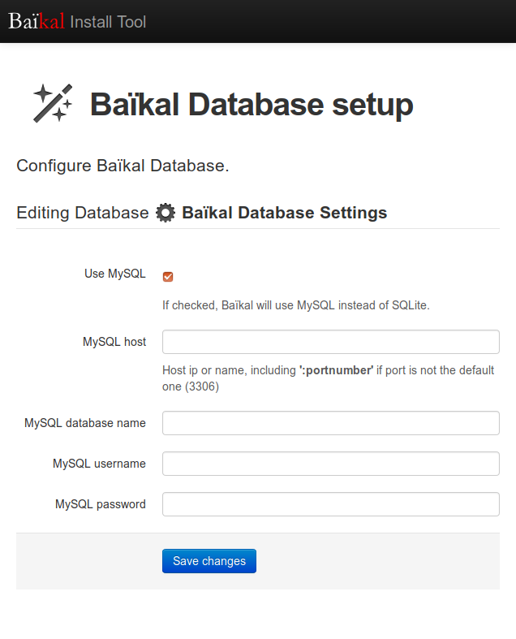

Il va nous falloir ensuite configurer la base de donner que nous souhaitons utiliser. Nous avons 2 possibilités :
- SQLite : une base de donnée stockée dans un fichier
- MySQL : une base de donnée plus classique et aussi plus fiable

Dans notre exemple nous utiliserons la base de donnée MySQL fournie par OVH, il faut donc saisir les informations de connexion à la base (host, port, database name, username, password)

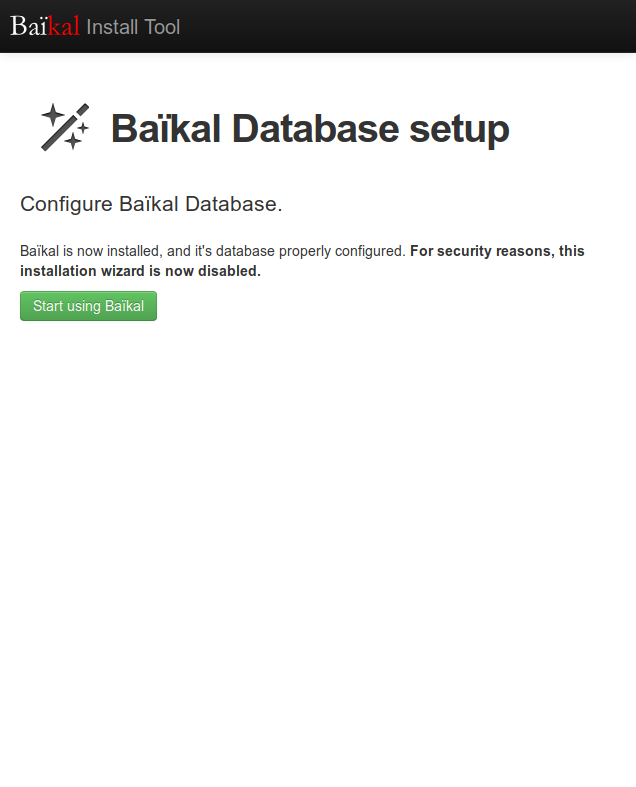

Une fois la base de donnée configurée nous pouvons utiliser Baïkal en accédant au menu d’administration : https://calendrier.monsite.fr/admin

### 2.2 Configurer son calendrier

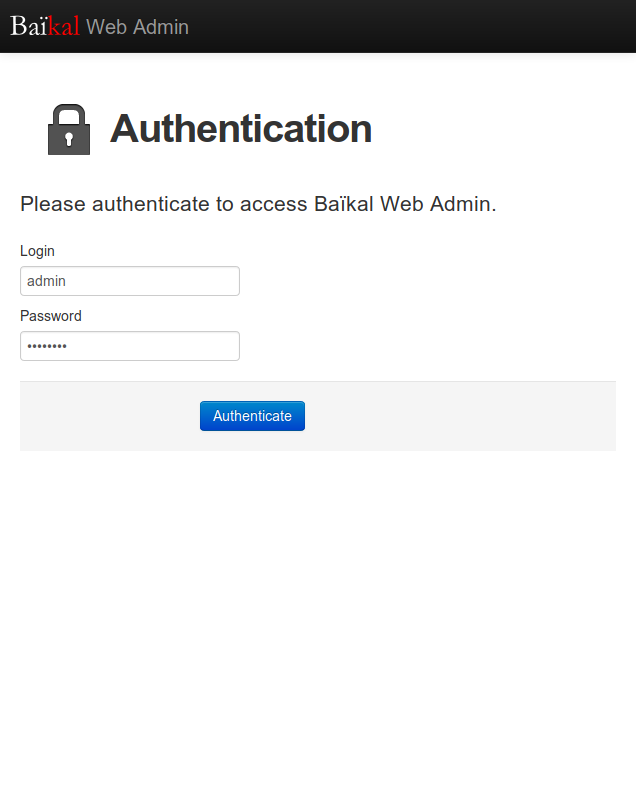

Connectons nous sur l’interface d’administration https://calendrier.monsite.fr/admin

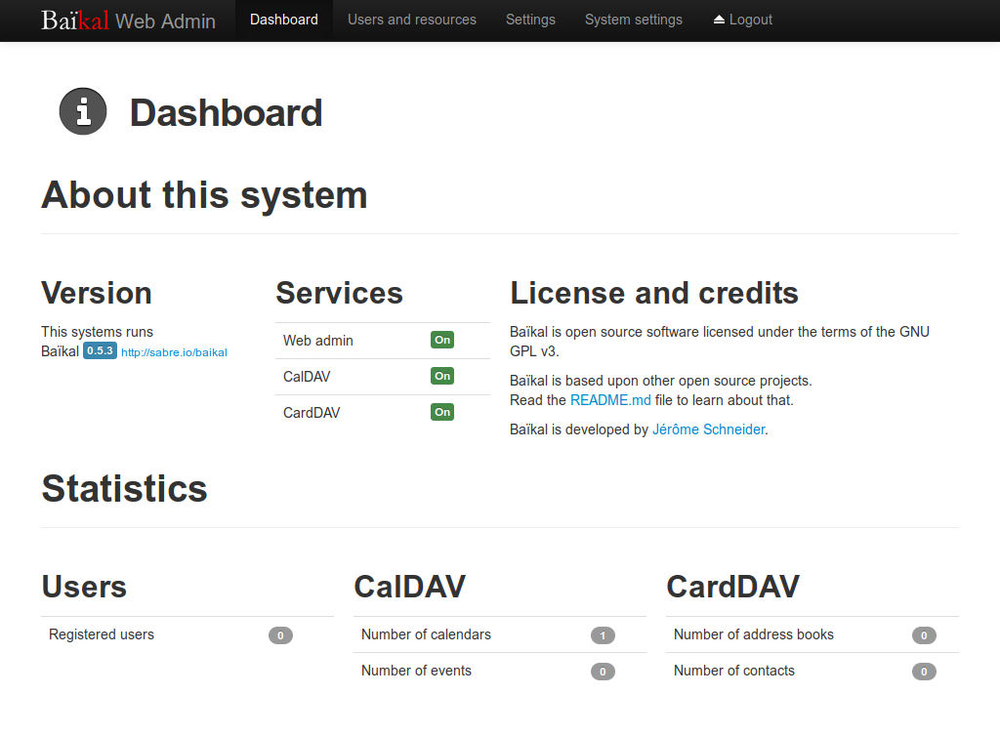

Une fois connecté la page principale apparaît (le dashboard). Les informations qui nous intéressent se situent an bas, on y découvre : le nombre d’utilisateurs, le nombre de calendriers, le nombre d’évènements, le nombre de carnets d’adresse ainsi que le nombre de contacts.

Créons maintenant un nouvel utilisateur, pour se faire il faut cliquer sur « Users and resources » tout en haute de l’interface d’administration

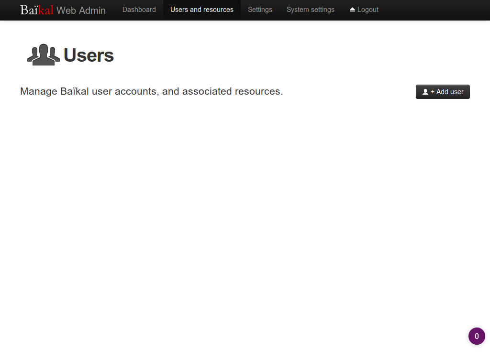

Pour le moment il n’y a pas d’utilisateur, créons donc un nouvel utilisateur avec le bouton « Add User »


Nous renseignons les informations de notre nouvel utilisateur qui va pouvoir utiliser calendrier et carnet d’adresse Baïkal.

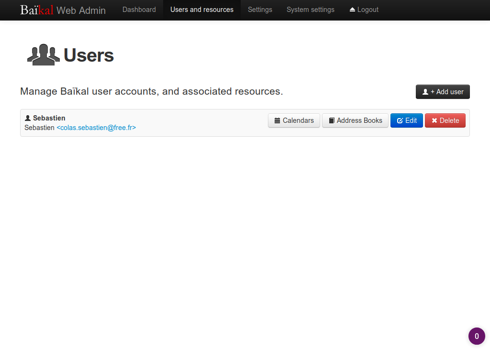

Accédons au maintenant à la configuration de notre utilisateur en cliquant sur « Calendars »

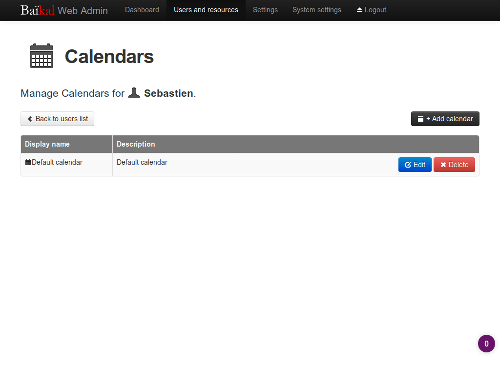

Nous constatons que notre utilisateur dispose d’un calendrier par défaut « Default Calendar ». Cliquons sur le bouton « edit » en bleu pour configurer ce calendrier.

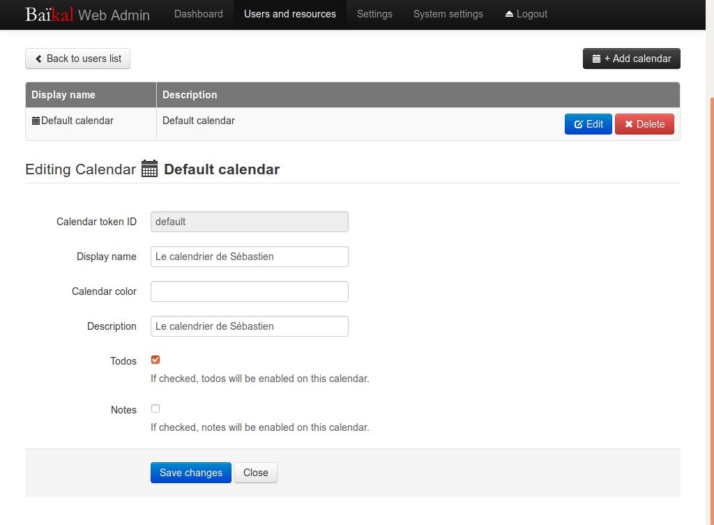

Le menu suivant nous apprend que l’ID de notre calendrier est default, nous pouvons ensuite changer différentes informations telles que le nom à afficher « Display Name » et la description « Description »

Validons les modifications en cliquant sur le bouton « Save changes »

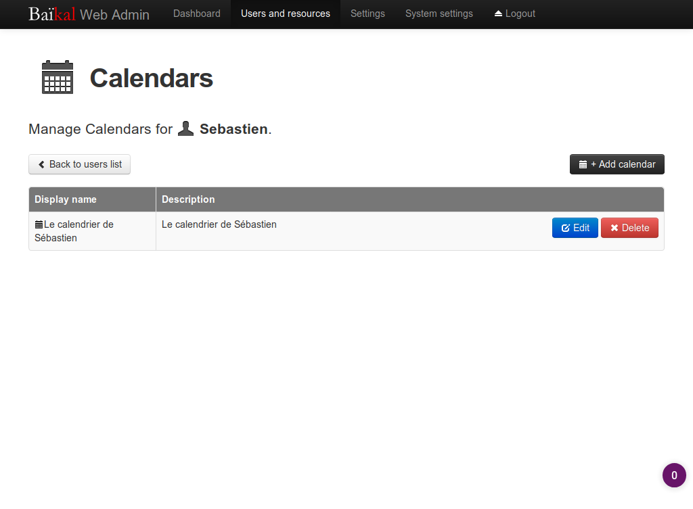

Notre calendrier est désormais prêt à l’emploi.

## 3 Utiliser son calendrier
Le calendrier est désormais opérationnel l’url d’accès est https://calendrier.monsite.fr/cal.php/calendars/Sebastien/defaut/

### 3.1 Calendrier Thunderbird

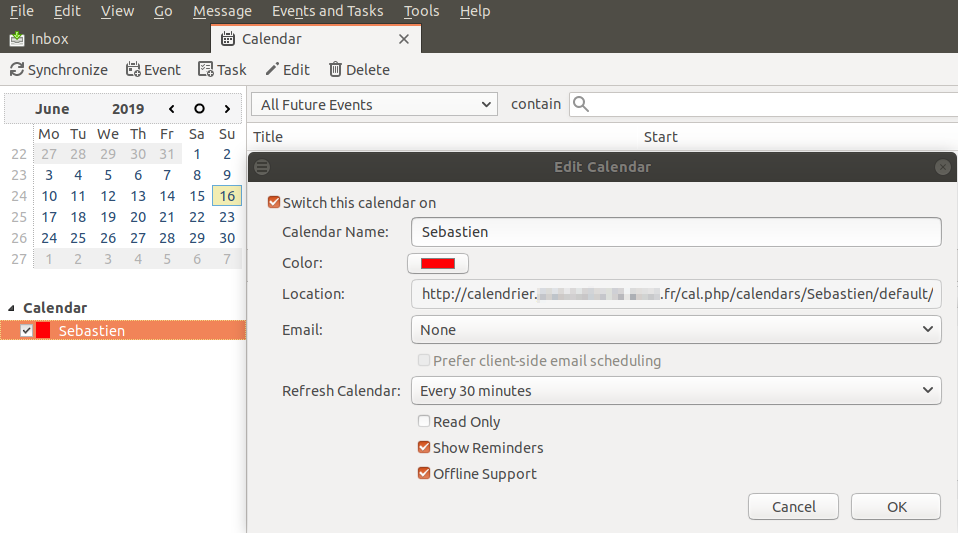

Sous Thunderbird pour ajouter notre calendrier on clique ajouter calendrier et on spécifie notre url.

### 3.2 Calendrier Android

Malheureusement les systèmes Android ne supportent pas nativement les calendriers CalDav.

Installons « Caldav Sync Free Beta »


Une fois installer nous pouvons ajouter un nouveau compte CalDav.


Entrons ensuite les paramètre de notre calendrier.


Notre calendrier est prête à l’emploi.


### 3.3 Calendrier IOS

Les systèmes IOS quant à eux supportent nativement les calendriers CalDav.

Configurons donc notre calendrier à l’aide de notre url.

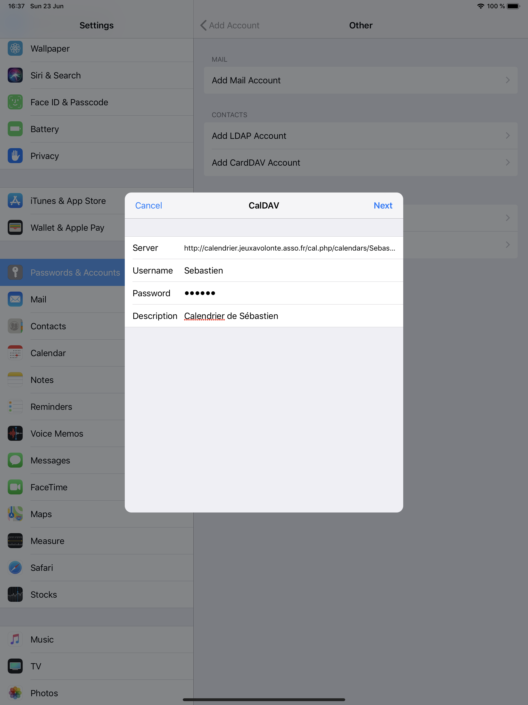

## 4 Créer un calendrier partagé

Il est très souvent utile de pouvoir partager son calendrier sans pour autant que celui-ci soit accessible en modification. Pour se faire il existe un plugin permettant de modifier les permissions. Téléchargeons le :

```
$ ls -l baikal
total 16
drwxr-xr-x 4 scolas scolas 4096 avril 23 15:55 Core
drwxr-xr-x 4 scolas scolas 4096 juin  17 19:10 html
drwxr-xr-x 3 scolas scolas 4096 mai   13 16:25 Specific
drwxr-xr-x 7 scolas scolas 4096 mai   13 16:26 vendor
$ cd baikal/html/admin
$ wget https://raw.githubusercontent.com/mrbaseman/calendar-tools/master/permissions.php
```

Une fois téléchargé envoyons le chez OVH en FTP.

Ensuite créons un nouvel utilisateur : public

Ce nouvel utilisateur accédera en lecture seul à notre précédent calendrier, il est donc conseillé de supprimer le calendrier par défaut de cet utilisateur.

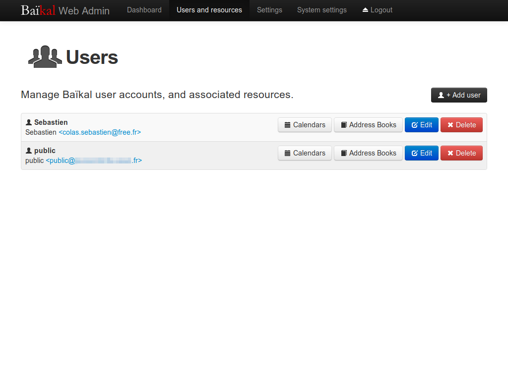

Donnons l’accès en lecture seule à public au calendrier Sebastien via l’url :
https://calendrier.monsite.fr/admin/permissions.php

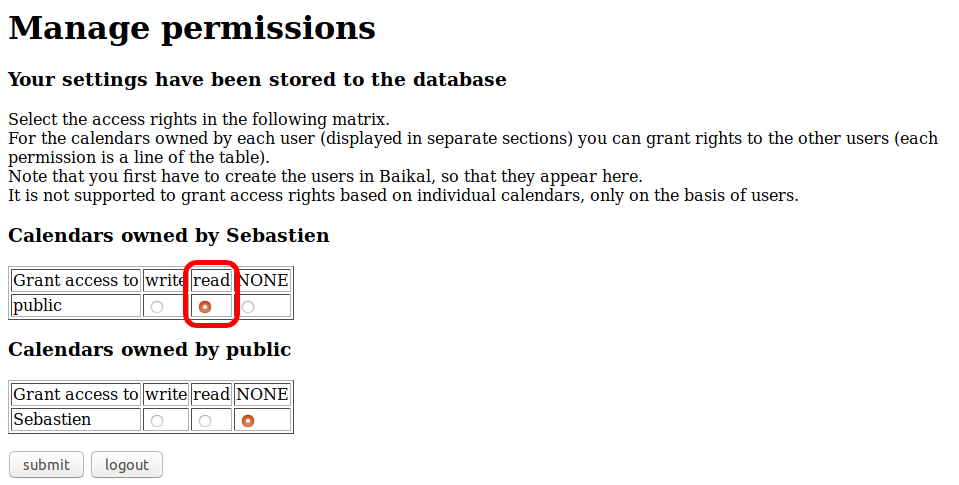

Finalement configurons l’accès au calendrier Sebastien avec l’utilisateur public.

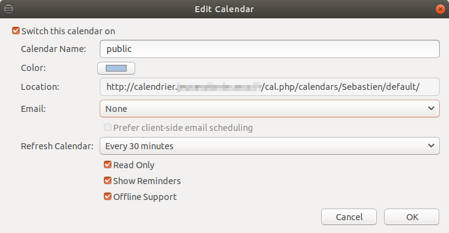

Désormais l’utilisateur public pourra consulter le calendrier de Sebastien sans pour autant pouvoir le modifier.

## Conclusion

En quelques étapes simples nous sommes désormais capable d’héberger nous même notre calendrier partagé et donc nous passer d’un fournisseur externe dont nous ne savons pas toujours comment sont utilisées nos données.


